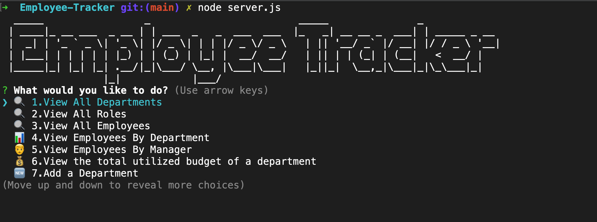
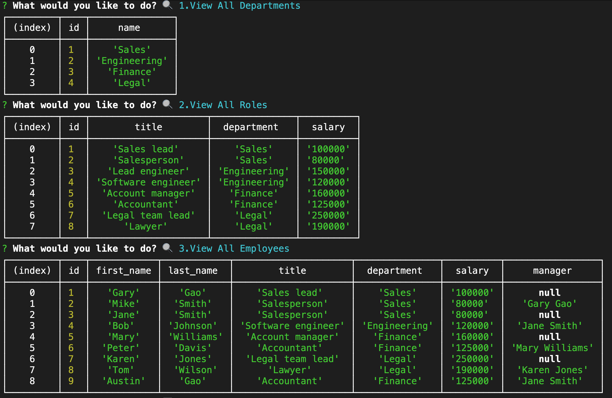
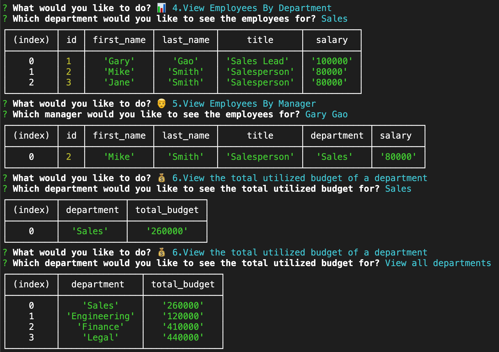

# Employee-Tracker


## Description

This project involves building a command-line interface application that allows users to manage employee data within a company. The main objective of the project is to provide a user-friendly interface that enables users to view, add, update and delete employee data, roles, and departments.

One of the problems encountered in this project was handling complex SQL queries that involved multiple table joins. In order to retrieve data that involved multiple tables, complex join statements had to be written, and errors could easily occur if these queries were not correctly written. Another challenge was designing a user-friendly interface that was easy to use for non-technical users. The use of the inquirer.js library was instrumental in providing an intuitive interface that enabled users to easily navigate and input data.

The project solved the problem of managing employee data within a company. With this application, users can easily view employee data such as their roles, salaries, and managers, and also add, update, and delete employee data.During the course of building this project, I learned several valuable skills. First, I became more proficient in using SQL and complex join statements. I also learned how to use the inquirer.js library to create user-friendly command-line interfaces. Additionally, I learned how to use the mysql2 library to connect to a MySQL database from a Node.js application.

Overall, this project provided an opportunity to work on a real-world application that involved building a user-friendly interface to manage employee data. The experience gained from this project can be applied to other projects that involve building command-line interfaces and working with databases.

## Table of Content

* [Installation](#installation)
* [Usage](#usage)
* [Contribution](#contribution)
* [License](#license)
  
## Made With


  
## Installation  

```
npm install
```

## Usage

To view this application,the following image shows the landing page of the application, or click on the page link that demonstrates the functionality of this project:
<https://drive.google.com/file/d/1pjZoeNHyLtQaLCwrDou7ymsYr-EE7KsX/view>









## License


Link to license: <https://opensource.org/licenses/MIT>

```
Copyright (C) 2023 Gary GAO

Permission is hereby granted, free of charge, to any person obtaining a copy of this software and associated documentation files (the "Software"), to deal in the Software without restriction, including without limitation the rights to use, copy, modify, merge, publish, distribute, sublicense, and/or sell copies of the Software, and to permit persons to whom the Software is furnished to do so, subject to the following conditions:

The above copyright notice and this permission notice shall be included in all copies or substantial portions of the Software.

THE SOFTWARE IS PROVIDED "AS IS", WITHOUT WARRANTY OF ANY KIND, EXPRESS OR IMPLIED, INCLUDING BUT NOT LIMITED TO THE WARRANTIES OF MERCHANTABILITY, FITNESS FOR A PARTICULAR PURPOSE AND NONINFRINGEMENT. IN NO EVENT SHALL THE AUTHORS OR COPYRIGHT HOLDERS BE LIABLE FOR ANY CLAIM, DAMAGES OR OTHER LIABILITY, WHETHER IN AN ACTION OF CONTRACT, TORT OR OTHERWISE, ARISING FROM, OUT OF OR IN CONNECTION WITH THE SOFTWARE OR THE USE OR OTHER DEALINGS IN THE SOFTWARE.
  
```
  
## Contribution

Thanks for the information about promise-wrapper information from webpage as follows:

<https://www.npmjs.com/package/mysql2#using-promise-wrapper>

## Tests

```
N/A
```

## Questions

N/A

## Contact

* For any question about this project, please email me at: gary.yanggao@gmail.com
* To see more of my projects, follow me on Github at: <http://github.com/Mid30s>
  
[](mailto:gary.yanggao@gmail.com)
[](https://github.com/Mid30s)
